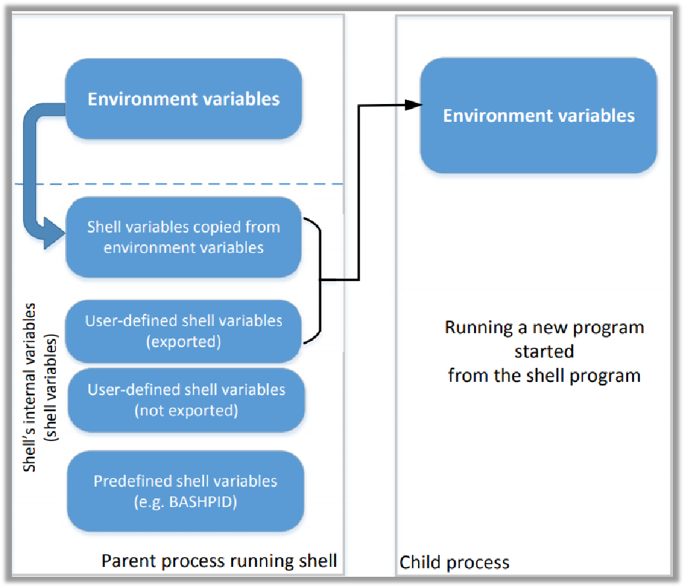

# 环境变量攻击

## 环境变量定义

- 一组动态的定义值；
- 操作系统运行环境的一部分；
- 影响正在运行进程的行为方式（加载哪些外部DLL）；
- 在Unix中提出，也被微软操作系统采用

<!-- more -->

 示例：PATH变量
 当执行一个程序时，如果没有提供完整的路径，shell进程将使用环境变量来找到程序的位置。

## 进程与环境变量

进程可以通过以下两种方式来获取环境变量：
如果使用**fork()**创建了一个新进程，则子进程将继承其父进程的环境变量。
如果进程使用**execve()**启动一个新程序，在此场景中内存空间被覆盖，**所有旧环境变量将丢失**。但是可以通过传参的方式传递旧的环境变量。

## shell命令变量与环境变量

**相关命令**：

-  env命令：显示当前用户的环境变量
-  set命令：不加参数可以显示当前shell的所有本地设置的**Shell变量**，否则设置shell变量
-  unset命令：unset为shell内建指令，删除变量或函数。
-  export命令：显示(设置)当前导出成环境变量的shell变量(注意：export为bash或类bash私有的命令)
-  echo $变量名：查看变量值(其中，$变量：引用变量的意思)

当shell程序启动时，它会将环境变量复制到自己的shell变量中。对shell变量所做的更改将不会反映出在环境变量上。

### /proc文件系统

/proc是linux中的一个虚拟文件系统（放在内存中）。它包含每个进程的一个目录，使用进程ID作为目录的名称。
每个进程目录都有一个名为environ的虚拟文件，其中包含进程的环境变量。
例如：虚拟文件/proc/932/environ 包含进程932的环境变量
命令“`strings /proc/$$/environ`”将打印出**当前进程的环境变量**(shell将把$$替换为它自己的进程ID)
当在bash shell中**调用env**程序时，它将在子进程中运行。因此，它打印出shell子进程的环境变量，而不是它自己的环境变量。

总结：

- set（无参数）可以打印当前的shell变量
- export（无参数）可以显示当前导出成环境变量的shell变量
- `strings /proc/$$/environ`可以打印当前进程的环境变量
- env可以打印当前进程的子进程的环境变量

## set-UID

允许用户以程序所有者的权限运行程序。 

每个进程都有两个用户ID。 
Real UID (**RUID**):确定进程的真正所有者	
Effective UID (**EUID**): 标识进程的权限
访问控制基于EUID
当执行正常程序时 , RUID = EUID, 它们都等于运行程序的用户的ID
当执行Set-UID时, RUID ≠ EUID. RUID还是用户 ID, 但是 EUID 是程序 owner的 ID.普通用户运行root用户所有的程序，以root权限运行。
如果程序归root所有，则程序以root权限运行。

### 通过动态链接器进行攻击

动态链接-使用环境变量，它将成为攻击面的一部分。

- 动态链接节省内存
- 这意味着程序在编译期间未决定部分代码
- 如果用户可以影响丢失的代码，它们可能会损害程序的完整性
- LD_PRELOAD 包含一个共享库的列表，链接器将首先搜索它；
  如果没有找到所有函数，链接器将在几个文件夹列表中搜索，包括LD_LIBRARY_PATH指定的文件夹；
  这两个变量都可以由用户设置，因此使他们有机会控制链接过程结果；
  如果该程序是一个Set-UID程序，它可能会导致安全漏洞。

**机制：**

现代编译器基本默认为动态链接,而动态链接就需要使用支持动态链接的程序库,而 **LD_LIBRARY_PATH 和 LD_PRELOAD** 就是与动态链接相关的两个环境变量，而这个两个环境变量可以被修改，那么结合 Set-UID 程序,便会导致安全问题,攻击者可能会编写 root 权限下运行的不安全函数,通过环境变量在链接阶段冒充真实函数来运行。

而动态链接器程序有一个防御机制,当进程的真实用户 ID 与有效用户 ID不 一 样 时 , 或 者 真 实 组 ID 与 有 效 组 ID 不 一 致 时 , 进 程 将 会 忽 LD_PRELOAD,LD_LIBRARY_PATH 环境变量。

