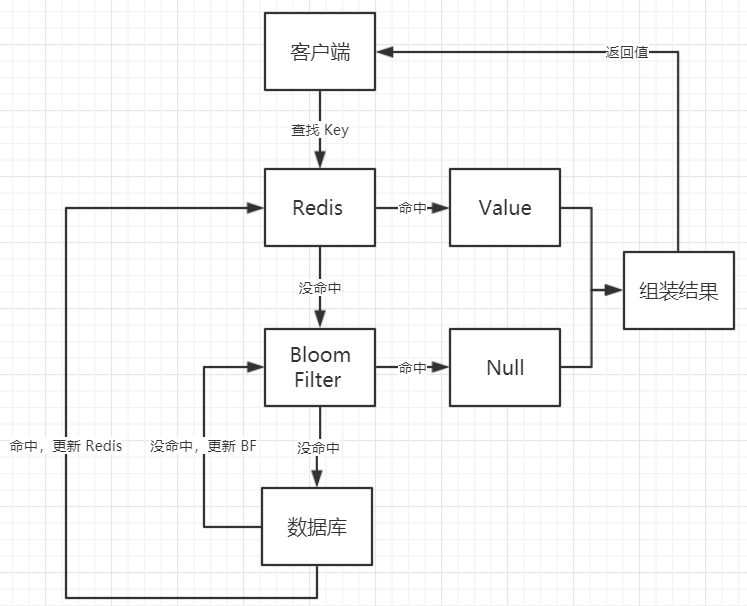
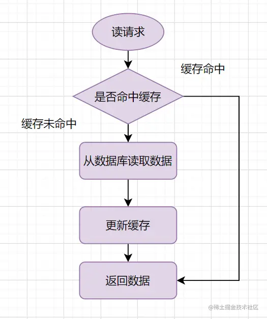

# Redis &缓存一致性

[图解Redis介绍 | 小林coding (xiaolincoding.com)](https://xiaolincoding.com/redis/)

## 常见数据类型和应用场景

### String

key-value结构

<!-- more -->

内部实现：String类型的底层的数据结构实现主要是int和SDS

命令：

- get
- set
- mget
- mset
- expire

场景：

常规计数：因为 Redis 处理命令是单线程，所以执行命令的过程是原子的。因此 String 数据类型适合计数场景，比如计算访问次数、点赞、转发、库存数量等等。

分布式锁：暂时没学

共享 Session 信息：在分布式系统中服务器分别保存session，则会导致用户出现重复登陆的情况（分布式系统可能会把请求随机到不同的服务器）-->解决：同一redis 管理session信息

### List

简单的字符串列表，可从头或尾添加元素

内部实现：底层数据结构是由双向列表或压缩链表 。在 Redis 3.2 版本之后，List 数据类型底层数据结构就只由 quicklist 实现了，替代了双向链表和压缩列表

命令：

- LPUSH/RPUSH
- LPOP/RPOP
- BLPOP/BRPOP

场景：

消息队列：

消息保序需求：先进先出的顺序对数据进行存取。List 可以使用 LPUSH + RPOP （or RPUSH+LPOP）命令实现消息队列。BRPOP命令也称为阻塞式读取，客户端在没有读到队列数据时，自动阻塞，直到有新的数据写入队列，再开始读取新数据

### Hash

Hash 是一个键值对（key - value）**集合**（ 或者说key-field-value），其中 value 的形式如： `value=[{field1，value1}，...{fieldN，valueN}]`。Hash 特别适合用于存储对象。

内部实现：Hash 类型的底层数据结构是由**压缩列表或哈希表**实现的。在 Redis 7.0 中，压缩列表数据结构已经废弃了，交由 listpack 数据结构来实现了。
一般对象用 String + Json 存储，对象中某些频繁变化的属性可以考虑抽出来用 Hash 类型存储。

命令：

- hmset
- hgetall

场景：购物车

## 缓存问题

### 缓存雪崩

redis大量缓存**同时**过期 or redis故障-->大量请求访问sql数据库-->数据库乃至系统崩溃

大量缓存同时过期：

1. 均匀设置过期时间（随机数）

2. 互斥锁：如果发现访问的数据不在 Redis 里，就加个互斥锁，保证同一时间内只有一个请求来构建缓存

3. 后台更新缓存：业务线程不再负责更新缓存，缓存也不设置有效期，设置缓存“永久有效”，并将更新缓存的工作交由后台线程**定时更新**。

   

### 缓存击穿

与缓存雪崩有点类似：热点数据缓存过期。

### 缓存穿透

缓存和数据库中均无数据：业务误操作 or 黑客恶意攻击

**策略**：

- 限制非法请求（大量非法请求也会导致缓存穿透）

- 缓存空值或者默认值
- 使用布隆过滤器

#### **布隆过滤器**

- 一个二进制向量加上多个hash函数；
- 快速，比哈希表更节省空间；
- 有误判（判断结果为存在的时候元素不一定存在，但是判断结果为不存在的时候则一定不存在）；不能删除元素；

布隆解决缓存穿透不一样的思路：（该种的思路不同于一般，仅作展示，经典思路略：这里先用的redis，用布隆存储不存在的数据，但有缺陷）



## 缓存与数据库一致性

**一致性**：

- 强一致性
- 弱一致性
- 最终一致性

### **缓存模式**
更新数据时，是更新缓存还是删除缓存：更新缓存的策略会在并发写时导致脏数据，下面介绍删除缓存：旁路缓存策略。
#### Cache-Aside旁路缓存
该策略下，读请求才会更新缓存（写请求直接清除缓存），所以考虑的并发情况为读-写并发。

**读请求**:



**写请求**：先写入数据库再清除redis旧缓存 or 先清除缓存再写入数据库：
考虑读-写并发，以上两种策略理论都会出现数据不一致的情况，但缓存写入的速度快于数据库，所以在前者的情况中（分析略），数据一致性是比较有保障的。（相对）。再者，可以给缓存加上一个**较短的过期时间**，给问题解决兜个底。

or 还有一个方法：缓存（延时）双删。延迟双删中的sleep不好把控。但其实，问题关键在于：不管是**延时双删**还是**先操作数据库再删除缓存**，如果第二步的删除缓存失败，删除失败就会导致**脏数据**——

一、引入**消息队列重试机制**：
把要删除的消息放入消息队列，由消费者进行删除。

二、订阅 MySQL binlog，再操作缓存。

暂未学习完.


## Redis持久化

RDB持久化，AOF持久化

### RDB持久化

默认的内置方法。周期性。

- Redis调用fork()，产生一个子进程。
- 子进程把数据写到一个临时的RDB文件。
- 当子进程写完新的RDB文件后，把旧的RDB文件替换掉。

RDB持久化的优点在于它生成的文件非常紧凑和稳定，是快速恢复大量数据的最佳选择。但是它也有一些缺点，例如需要频繁的将整个数据集写入磁盘，这会造成磁盘I/O的瓶颈，影响Redis的性能。同时，由于快照是在一个瞬间进行的，所以如果在生成快照的时候出现宕机，可能会造成数据的损失。

可手动触发：

- save：阻塞其他所有客户端的请求
- bgsave：异步

**持久化配置**：

```conf
#900s内有一条写入命令就触发一次快照
save 900 1 
save 300 10 
save 60 10000
```


### AOF持久化

支持秒级持久化、兼容性好，缺点是文件大、恢复速度慢、对性能影响大

## 其他：Redis未授权访问漏洞

[Redis未授权漏洞复现及利用（window,linux）_windows下redis未授权访问漏洞修复](https://blog.csdn.net/dreamthe/article/details/123427989)
