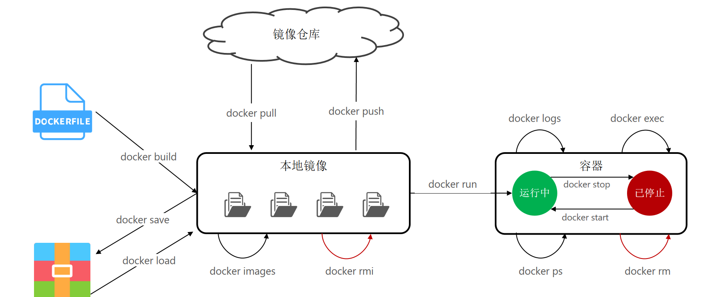
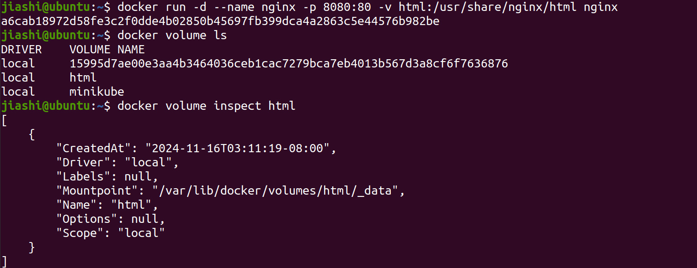

<!-- more -->
## docker命令

基础的命令：

```bash
docker images
docker ps -a
docker rm xxx
docker rmi xxx
docker pull xxx
```

启动容器：

```bash
docker run -d \
  --name mysql \
  -p 3306:3306 \
  -e TZ=Asia/Shanghai \
  -e MYSQL_ROOT_PASSWORD=123 \
  mysql:5.7
```

-d:  让容器后台运行

--name： 给容器命名

-e: 环境变量

-p: 宿主机端口映射到容器内端口   

镜像名称结构：Repository:TAG




```bash
docker save -o nginx.tar
```

```bash
docker load -i nginx.tar 
```

```bash
docker exec -it nginx bash
```

比较好用的调试命令：

```bash
docker logs xxx # 查看日志信息，比如可以检查java程序启动状况
docker exec -it xxx /bin/bash # 连接shell
```


## docker 数据卷挂载

数据卷 volume, 宿主机和容器之间的中间桥梁.

```bash
docker volume create

docker volume ls

docker volume rm

docker volume inspect

docker volume prune
```

使用-v命令，会自动创建和挂载。

注：

- 在执行docker运行命令时，使用-v **本地目录**:**容器内目录**可以完成本地目录挂载；
- 本地目录必须以“/”或"./"开头，如果直接以名称开头，会被识别为数据卷而非本地目录；
- -v mysql:/var/lib/mysql会被识别为一个数据卷叫mysql；
- -v ./mysql:/var/lib/mysql 会被识别为当前目录下的mysql目录。



**mountpoint**：在宿主机中的文件位置。

## Dockerfile与自定义镜像

镜像结构分层：分为多层（Layer），体现为pull镜像时会拉取多个。

基础镜像（BaseImage）：依赖的系统函数库，环境，配置，文件等。

-->

层（Layer）：多个，添加更多的安装包，依赖等。

-->

入口（Entrypoint）：一般是程序启动的脚本or参数。


那**什么是Dockerfile**:  类似于脚本文件，有一条条的指令，来指导构建镜像。

部分语法如下：

| **指令**   | **说明**                                     | **示例**                                                     |
| ---------- | -------------------------------------------- | ------------------------------------------------------------ |
| FROM       | 指定基础镜像                                 | FROM centos:6                                                |
| ENV        | 设置环境变量，可在后面指令使用               | ENV key value                                                |
| COPY       | 拷贝本地文件到镜像的指定目录                 | COPY ./jre11.tar.gz /tmp                                     |
| RUN        | 执行Linux的shell命令，一般是安装过程的命令   | RUN tar -zxvf /tmp/jre11.tar.gz&& EXPORTS path=/tmp/jre11:$path |
| EXPOSE     | 指定容器运行时监听的端口，是给镜像使用者看的 | EXPOSE 8080                                                  |
| ENTRYPOINT | 镜像中应用的启动命令，容器运行时调用         | ENTRYPOINT java -jar xx.jar                                  |

例：构建一个运行springboot的jar项目，Dockerfile内容如下：

```
# 基础镜像
FROM openjdk:11.0-jre-buster
# 设定时区
ENV TZ=Asia/Shanghai
RUN ln -snf /usr/share/zoneinfo/$TZ /etc/localtime && echo $TZ > /etc/timezone
# 拷贝jar包
COPY project.jar /app.jar
# 入口
ENTRYPOINT ["java", "-jar", "/app.jar"]
```


根据Dockerfile在本地构建镜像的命令：

```bash
docker build -t myjava:1.0 .  # .表示在当前目录下找Dockerfile
```

## docker网络

```bash
docker network xxx
```

docker的bridge网络模式是Docker的默认网络模式。当Docker进程启动时，它会在主机上创建一个名为**docker0的虚拟网桥**。此主机上启动的Docker容器会连接到这个虚拟网桥上。这个虚拟网桥的工作方式类似于物理交换机，使得主机上的所有容器都通过交换机连接在一个二层网络中。
容器内部会有一个虚拟网卡，名为eth0，容器之间可以通过这个虚拟网卡和内部的IP地址进行通信。另外，从docker0子网中分配一个IP给容器使用，并设置docker0的IP地址为容器的默认网关。

创建的两个容器如果没有指定相同的网络，会使用默认的bridge 模式的名为bridge的网络，只能通过ip访问，如果指定了自定义的网络（bridge模式），也可以进行dns解析。（q:通过容器名访问是怎么实现的？）


如果要部署自己的一个多容器微服务，最好创建一个新的虚拟bridge网络：

```bash
docker network create net1
```

**参考**：

docker网络进阶1：[docker网络配置：bridge模式、host模式、container模式、none模式 - 熊仔其人 - 博客园 (cnblogs.com)](https://www.cnblogs.com/xiongzaiqiren/p/18177383/docker-network)

docker网络进阶2：[全网最详细的Docker网络教程详解Docker网络详解 Docker网路基础理论 docker使用Linux桥接网卡， - 掘金 (juejin.cn)](https://juejin.cn/post/7041923410649153543)

创建新的bridge网络与默认的bridge网络有什么区别：[两个或多个docker容器之间通过名字相互访问 - 知乎 (zhihu.com)](https://zhuanlan.zhihu.com/p/258939355)

### docker网络问题解决

1. docker网络疑难杂症解决：[【docker】重建docker0网桥-阿里云开发者社区 (aliyun.com)](https://developer.aliyun.com/article/1416790)


2. 虚拟机docker断连问题：[解决每次挂起VM虚拟机后，docker容器无法访问的问题](https://blog.csdn.net/weixin_46439731/article/details/128124219) --[原文 stackoverflow]([Can't connect to docker after resuming VM - Stack Overflow](https://stackoverflow.com/questions/57874055/cant-connect-to-docker-after-resuming-vm))


总结：如果发现连接不上docker，可以先用`ifconfig -a`检查docker0，发现其down了，可以临时用1方法解决。但每次vmware挂起似乎都会导致docker0网卡down，长久的解决方案参考2方法。

## DockerCompose

通过docker-compose.yml来实现**多个**互相关联的docker容器的快速部署。

```bash
docker compose up -d
docker compose down
docker compose ps #查看当前项目下所有容器
```

Docker Compose 会检查每个服务的镜像是否已经存在。**如果镜像已经存在，它不会重新构建镜像**，而是直接使用现有的镜像来启动容器。


```bash
docker compose up --build //强制重新构建镜像
```


记一句：如果真遇到什么连接不通或者其他疑难杂症，直接**重启**解决80%问题！