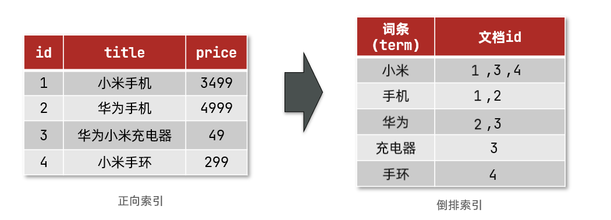
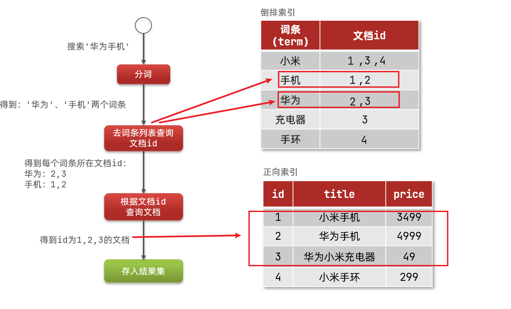

<!-- more -->

# 分布式搜索引擎ES
参考链接：
https://www.cnblogs.com/buchizicai/p/17093719.html

## 背景
底层基于lucene

## 倒排索引
该概念是基于MySQL这样的正向索引而言。

在正向索引中，如果设置了索引，那查询效率比较合理（比如根据主键ID进行查询），但是如果进行**模糊查询**，那就只能逐行即全表扫描。

**两个概念**：

- 文档：一条数据
- 词条：对文档进行分词得到的词

**创建倒排索引**：
分词得到词条->创建表->给词条建索引


查询流程：


概念区分：

- 正向索引是最传统的，根据id索引的方式。但根据词条查询时，必须先逐条获取每个文档，然后判断文档中是否包含所需要的词条，是根据文档找词条的过程。
- 而倒排索引则相反，是先找到用户要搜索的词条，根据词条得到保护词条的文档的id，然后根据id获取文档。是根据词条找文档的过程。


## ES数据库基本概念

### 文档和字段
一个文档就像数据库里的一条数据（一行），字段就像数据库里的列。
**文档->行
字段->列**

es面向文档存储，文档被序列化成json格式存储。

```json
{
    "id":1,
    "title":"小米手机",
    "price":3499
}
{
    "id":2,
    "title":"华为手机",
    "price":4999
}

```

### 索引和映射
**索引->表
映射->约束**

**映射**：

- Text：分词——>模糊匹配，全文搜索，不聚合查询
- keyword：不分词——>精确匹配，聚合查询
- Date

### DSL vs SQL
DSL是es提供的JSON风格的请求语句，用来操作es，实现CRUD


### 使用CURL 交互

`curl -X<VERB> '<PROTOCOL>://<HOST>:<PORT>/<PATH>?<QUERY_STRING>' -d '<BODY>'`

一些简单的操作：

查看所有索引（类似show tables）：`curl -X GET "http://localhost:9200/_cat/indices?v"`
（cat 表示查看的意思， indices 表示索引）

`GET /my-index/_search`

`curl -X GET "http://localhost:9200/my-index/_search/?q=*&pretty"`

`GET /my-index/_mapping`


更复杂的建议不要以url携带的形式而是以body的形式携带查询参数。

详细参考链接：https://segmentfault.com/a/1190000042059652


## ES滚动查询优化浅析

某实际业务问题涉及。目标：导出大量数据至CSV。
ES传统分页查询在面临巨大的数据量时效率很低（from+size）.from越大，越慢。且一般有10000的上限.

solve: scroll API [or search after + pit].

scroll API用于**全量/大量数据导出**比search after更有优势。后者的优势是更新的数据也会实时反映和查询出来，前者在第一次查询时会创建一个上下文（非实时），可能会占据一定堆内存。
调研看到过说法是用pit+search after的效果也比较不错，但是当时公司所使用的es版本并不支持PIT这个特性，未深入研究.