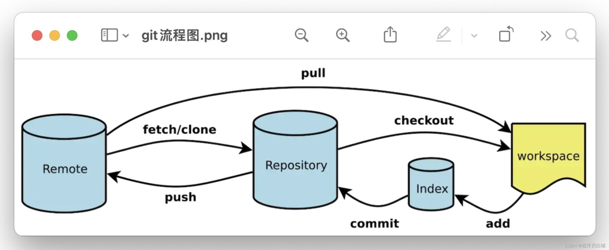

# git基础知识点


```bash
#查看当前工作区和暂存区的状态
git status 
```

<!-- more -->

```bash
#列出所有本地分支
git branch
#列出所有本地分支和远程分支
git branch -a
#列出远程分支
git branch -r
#查看本地分支与远程分支的关联关系
git branch -vv 
```

以上命令在windows的git bash使用时按q键退出。


```bash
#check out 远程的master分支，在本地起名为master分支，**并切换到** 本地的master分支
git checkout -b master origin/master
```
