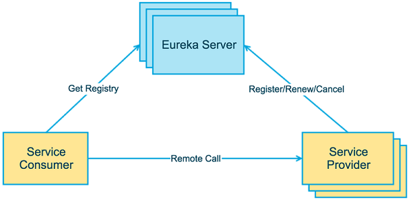

<!-- more -->
# Spring Cloud 学习

## 微服务与Cloud 版本

[初识Spring Cloud与微服务 | MrBird](https://mrbird.cc/Spring-Cloud%20and%20MicroService.html)

简单学习下neflix的几个组件，后面主要学习spring cloud Alibaba的几个更新的组件.

## Eureka服务治理

[Spring Cloud Eureka服务治理 | MrBird](https://mrbird.cc/Spring-Cloud-Eureka.html)

Eureka, 由netflix开发的一款开源服务治理框架。

**Eureka Server**：服务注册中心

**Eureka Provider**:  服务提供者



**搭建服务注册中心**

yml配置：

```yml
server:
  port: 8080
  
eureka:
  instance:
    hostname: localhost
  client:
    register-with-eureka: false
    fetch-registry: false
    service-url:
      defaultZone: http://${eureka.instance.hostname}:${server.port}/eureka/

```

版本变更：升级cloud的版本以适应更新版本的spring boot，eukera的包的名称在新版本中更名。

```xml
<dependencyManagement>
    <dependencies>
        <dependency>
            <groupId>org.springframework.cloud</groupId>
            <artifactId>spring-cloud-dependencies</artifactId>
<!--        <version>Edgware.SR3</version> -->
            <version>2021.0.9</version>
            <type>pom</type>
            <scope>import</scope>
        </dependency>
    </dependencies>
</dependencyManagement>

<dependencies>
    <dependency>
        <groupId>org.springframework.cloud</groupId>
<!--        <artifactId>spring-cloud-starter-eureka-server</artifactId> -->
        <artifactId>spring-cloud-starter-netflix-eureka-server</artifactId>
    </dependency>
</dependencies>
```

**搭建服务提供者**

版本变更同上。

其中涉及到的变化：getLocalServiceInstance方法已经弃用。

```java
@Autowired
private DiscoveryClient client;

@GetMapping("/info")
public String info() {
    @SuppressWarnings("deprecation")
    ServiceInstance instance = client.getLocalServiceInstance();//该方法已经弃用
    String info = "host：" + instance.getHost() + "，service_id：" + instance.getServiceId();
    log.info(info);
    return info;
}
```

更新的方法：

```java
@Qualifier("eurekaRegistration")
@Autowired
private Registration registration;

@GetMapping("/info")
public String info() {
    @SuppressWarnings("deprecation")
    String info = "host：" + registration.getHost() + "，service_id：" + registration.getServiceId();
    log.info(info);
    return info;
}
```

**搭建服务注册中心的集群**

即搭建两个Eukera-Server组成集群。在之前我们设置了**register-with-eureka**与 **fetch-registry**两个参数为false，这里设置为true（默认为true，即可以不额外设置），则eukera-server的俩个（多个）节点之间会进行信息同步。

配置如下：（编写application-peer1.yml,application-peer2.yml, 文件命名为固定格式application-{}）

```yml
#单个服务注册中心为如下
#eureka:
#  instance:
#    hostname: localhost
#  client:
#    register-with-eureka: false
#    fetch-registry: false
#    serviceUrl:
#      defaultZone: http://${eureka.instance.hostname}:${server.port}/eureka/

#eukera.client.serviceUrl.defaultZone配置成另一个服务器的url，peer1中填写peer2，peer2中填写peer1
eureka:
  instance:
    hostname: peer1
  client:
    service-url:
      defaultZone: http://peer2:8081/eureka/
  server:
    enable-self-preservation: false

```

**启动集群**

将spring项目打包成jar，然后使用以下命令启动peer1,peer2两个节点

```bash
java -jar Eureka-Service-0.0.1-SNAPSHOT.jar --spring.profiles.active=peer1
java -jar Eureka-Service-0.0.1-SNAPSHOT.jar --spring.profiles.active=peer2
```

问题：这里的副本显示为不可用。


解决方案参考网址: [搭建eureka集群时出现“unavailable-replicas”问题的解决办法](https://blog.csdn.net/weixin_43872111/article/details/118426384)

更改配置application-peer1.yml文件(peer2类似):

```yml
server:
  port: 8080

spring:
  application:
    name: Eureka-Server

eureka:
  instance:
    hostname: peer1
    prefer-ip-address: false  #add
  client:
    service-url:
      defaultZone: http://peer2:8081/eureka/
    register-with-eureka: true #add
    fetch-registry: true      #add
  server:
    enable-self-preservation: false
```

没有搞懂的是，这三个点明明都是默认值，但为什么需要设置出来才有效果呢。。（idea显示）


**搭建服务消费者**

ribbon 负载均衡。在新版本中已经不再使用。被springcloud中的Loadbalancer所替代。如下图。


参考的老代码中使用@LoadBalanced注解来启用负载均衡功能。新版本中依旧使用该注解，与RestTemplate这个bean一起使用。

## ribbon负载均衡

[Spring Cloud Ribbon客户端负载均衡 | MrBird](https://mrbird.cc/Spring-Cloud-Ribbon-LoadBalance.html)

之前已经提到，ribbon在新版本中已经不再使用，而是使用Spring cloud框架下的**Loadbalancer**。

## Hystrix服务容错

[Spring Cloud Hystrix服务容错 | MrBird](https://mrbird.cc/Spring-Cloud-Hystrix-Circuit-Breaker.html)


## 组件的对应

前面提到的组件全由neflix开源和维护，有些已经停止更新, 而阿里自己开发了新的一套组件, 配合spring cloud Alibaba进行使用.

[一篇文章掌握SpringCloud与SpringCloud Alibaba的区别_springcloud和springcloudalibaba-CSDN博客](https://blog.csdn.net/qq_30713721/article/details/135309626)


## Nacos注册中心

需要搭配数据库进行使用。自定义启动docker需要配置好数据库参数，或者其他方式。

8848port为管理GUI端。

基本原理与eureka一致。


## OpenFeign

本身是对http Restful访问方式的进一步封装。Dubbo还未学习。

除了本身的依赖，还要引入负载均衡的依赖：

```xml
<dependency>
  <groupId>org.springframework.cloud</groupId>
  <artifactId>spring-cloud-starter-loadbalancer</artifactId>
</dependency>
```

- 编写FeignClient

OpenFeign与普通的Feigin的区别便在于**支持了`Spring MVC`的注解**，如`@RequestMapping`，`@PathVariable`等等，可以方便开发者编写代码。

```java
@FeignClient(value = "item-service", fallbackFactory = ItemClientFallbackFactory.class)
public interface ItemClient {
    @GetMapping("/items")
    List<ItemDTO> queryItemByIds(@RequestParam("ids")Collection<Long> ids);
}
```

- 使用FeignClient 实现远程调用
- client的代码封装在子module xxx-api中，某种规范（未深入研究）

**http连接池**-高效

OpenFeign整合OKHttp

```xml
<dependency>
    <groupId>io.github.openfeign</groupId>
    <artifactId>feign-okhttp</artifactId>
</dependency>
```

```yaml
#application.yaml设置开启连接池
feign:
  okhttp:
    enabled: true
```

**日志**

可以控制openFeign输出日志的级别。

```java
public class DefaultFeignConfig {
    @Bean
    public Logger.Level fullFeignLoggerLevel(){
        return Logger.Level.FULL;
    }
}
```

自定义Bean，而且还需要指定该Bean才能生效。

1. 全局生效（微服务的一个服务）：

```java
//增加一个defaultConfiguration
@EnableFeignClients(basePackages = "com.hmall.api.client", defaultConfiguration = DefaultFeignConfig.class)
```

2. 单个client生效：

```java
@FeignClient(value = "item-service",configuration = DefaultFeignConfig.class)
```

## Spring Cloud Gateway

场景：用户信息传递

gateway在拦截校验后可以将用户的token传给某个微服务A（存入Threadlocal），但如果微服务A调用微服务B的服务（利用openFeign调用），如何将token再从A传到B？

即，token在微服务之间如何进行传递？

Feign中提供的一个拦截器接口：`feign.RequestInterceptor`

```Java
public interface RequestInterceptor {

  /**
   * Called for every request. 
   * Add data using methods on the supplied {@link RequestTemplate}.
   */
  void apply(RequestTemplate template);
}
```


## nacos配置中心

剥离配置，对配置进行统一管理，减少冗余；

通过nacos，我们可以更方便的进行配置管理，可以实现配置的**热更新**而无需重启微服务。


配置加载优先级：

bootstrap.properties ->bootstrap.yml -> application.properties -> application.yml.


nacos配置中心有一个data ID的概念，其格式为**[服务名]-[spring.active.profile].[后缀名]**。