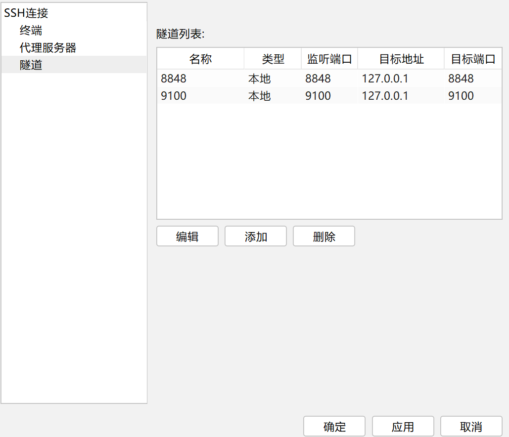
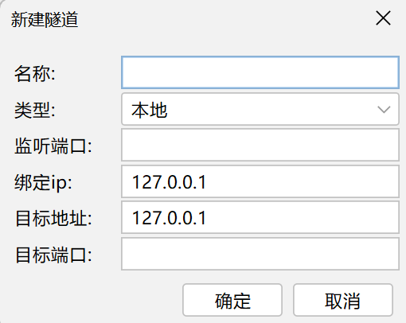

<!-- more -->

本文介绍两种方法来访问内网的服务。

# 用ssh访问内网服务器的服务

情况：服务器是虚拟化分出来的，本身没有公网地址，ssh的22端口是通过端口转发/映射到公网IP上的某个端口，可以`ssh user@公网IP -p 33333`，但想从外面访问服务器的一些服务（如3306的mysql，80的nginx），因为这些端口没有设置映射（自己没有权限），没有直接映射到公网上。

solv：**ssh本地转发**（-L 参数）。

本地转发（local forwarding）指的是，SSH 服务器作为中介的跳板机，建立本地计算机与特定目标网站之间的加密连接。本地转发是在本地计算机的 SSH 客户端建立的转发规则。

效果：指定一个本地端口（local-port），所有发向那个端口的请求，都会转发到 SSH 跳板机（tunnel-host），然后 SSH 跳板机作为中介，将收到的请求发到目标服务器（target-host）的目标端口（target-port）。

```bash
ssh -L local-port:target-host:target-port tunnel-host 
```

实际应用如下，访问内网服务器的8080开放的http服务。

```bash
ssh -L 8080:127.0.0.1:8080 user@222.222.222.222 -p 55322  -N
#222.222.222.222指代公网IP，55322是内网服务器映射的外网端口
```

- `-N`参数，表示不在 SSH 跳板机执行远程命令，让 SSH 只充当隧道。
- `-f`参数表示 SSH 连接在后台运行。


## 使用finalshell配置本地转发

编辑连接，配置ssh连接隧道。



新建隧道，选择类型为本地转发。



**参考学习**：

[SSH 端口转发](https://www.cainiaojc.com/ssh/ssh-port-forwarding.html)


# 使用frp进行内网穿透

前者是在使用ssh命令的机器上可以访问到内网服务器上的一些服务，而使用frp有两个特点：

- **需要一个另外的公网服务器**作为中介；
- 与前者是在使用ssh命令的机器上可以访问到内网服务器上的一些服务有所不同，frp使得可以在外网所有地方直接访问内网服务。

**使用方法**：

[github地址](https://github.com/fatedier/frp)

[文档地址](https://gofrp.org/zh-cn/)

下载frp（客户端与服务端），内容应该如下（linux版）：

```txt
frpc      //客户端程序
frpc.toml //客户端配置文件
frps      //服务端程序
frps.toml //服务端配置文件
```

在公网server上启动frps（服务端程序）,或配置成service自动运行（参考官网文档）

```bash
./frps -c frps.toml 
```

```toml
# frps.toml
bindPort = 7070 # 默认端口为7000，最好做修改
auth.token="xxxxxx" # 使用token鉴权
```

在内网server上启动frpc

```bash
./frpc -c frpc.toml # windows:frpc.exe -c frpc.toml
```

```toml
# frpc.toml
serverAddr="11.11.11.11" # 运行frps的公网server的ip地址
serverPort=7070 # 与上面的端口对应
auth.token="xxxxxx"
[[proxies]]
name="minecraft"
type="tcp"
localIP="127.0.0.1"
localPort=25565   # 本地要转发的端口
remotePort=25565  # 映射到公网ip的端口
```

