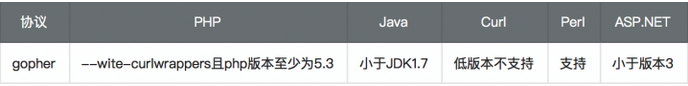

# SSRF漏洞

## 漏洞介绍

SSRF(Server-Side Request Forgery:服务器端请求伪造) 是一种由攻击者构造形成由服务端发起请求的一个安全漏洞。一般情况下，SSRF攻击的目标是从外网无法访问的内部系统。

<!-- more -->

（正是因为它是由服务端发起的，所以它能够请求到与它相连而与外网隔离的内部系统）

SSRF 形成的原因大都是由于服务端提供了从其他服务器应用获取数据的功能且没有对目标地址做过滤与限制。

比如,黑客操作服务端从指定URL地址获取网页文本内容，加载指定地址的图片，下载等等。利用的是服务端的请求伪造。ssrf是利用存在缺陷的web应用作为代理攻击远程和本地的服务器。


### 可能场景-漏洞点挖掘

1. 分享：通过URL地址分享网页内容

   获取超链接的标题等内容进行显示

2. 转码服务:通过URL地址把原地址的网页内容调优使其适合手机屏幕浏览:由于手机屏幕大小的关系，直接浏览网页内容的时候会造成许多不便，因此有些公司提供了转码功能，把网页内容通过相关手段转为适合手机屏幕浏览的样式。例如百度、腾讯、搜狗等公司都有提供在线转码服务。

3. 在线翻译:通过URL地址翻译对应文本的内容。提供此功能的国内公司有百度、有道等。

4. 图片、文章收藏功能:此处的图片、文章收藏中的文章收藏就类似于分享功能中获取URL地址中title以及文本的内容作为显示，目的还是为了更好的用户体验，而图片收藏就类似于图片加载。

5. 图片加载与下载:通过URL地址加载或下载图片。

6. 从远程服务器请求资源（upload from url 如discuz！；import & expost rss feed 如web blog；使用了xml引擎对象的地方 如wordpress xmlrpc.php）

简单来说：**所有目标服务器会从自身发起请求的功能点，且我们可以控制地址的参数，都可能造成SSRF漏洞**。

### 产生SSRF漏洞的函数

php中有例如以下函数：

```php
file_get_contents()
fsockopen()
curl_exec()
fopen()
readfile()

//curl_exec() 默认不跟踪跳转
//file_get_contents支持php://input协议
```

## 漏洞利用

### 伪协议

file:/// 从文件系统中获取文件内容（访问本地文件系统），如，file:///etc/passwd
dict:// dict协议一般常用来探测**内网主机以及端口开放**情况，既然能够探测端口，那么可以探测不同端口对应的服务的指纹信息
sftp:// SSH文件传输协议或安全文件传输协议
ldap:// 轻量级目录访问协议
tftp:// 简单文件传输协议
gopher:// 分布式文档传递服务，可使用gopherus生成payload



**file**

```
file:///etc/hosts
```


```
file:///var/www/html/index.php
```

**dict**

1、探测内网主机

2、探测端口的开放情况和指纹信息

3、执行命令 dict://serverip:port/命令:参数 （每次只能执行一条命令）

```
dict://172.18.240.5:80/
```

dict协议直接攻击未授权 **Redis** 服务（即无密码，有密码的话无法实现，因为每次执行命令还需要先认证）：

```bash
dict://x.x.x.x:6379/<Redis 命令>
```

**gopher**

gopher支持发出get，post请求（万能协议）

gopher协议在ssrf的利用中一般用来攻击redis，mysql，fastcgi，smtp等服务。

gopher协议数据格式：

gopher://ip:port/_{TCP/IP数据流}

注意：

gopher协议数据流中，url编码使用%0d%0a替换字符串中的回车换行
数据流末尾使用%0d%0a代表消息结束

gopher协议是个tcp/ip协议，通过gopher协议可以发送tcp stream，payload使用%+16进制编码，（原理比较简单，可以用tcpdump或者wireshark把stream一段段复制出来）


## 漏洞bypass

在通常情况下，对SSRF的防御措施是对URL特征参数进行检测和过滤、设置可访问URL白名单或使用户无法控制URL的参数，一但过滤的措施不够严密，就会存在多种Bypass方式。

1. @　　　　　　　　　　http://abc.com@127.0.0.1

2. 添加端口号　　　　　　http://127.0.0.1:8080

3. 短地址　　　　　　　　https://0x9.me/cuGfD      

4. 可以指向任意ip的域名　 xip.io                     原理是DNS解析。xip.io可以指向任意域名，即127.0.0.1.xip.io，可解析为127.0.0.1

5. ip地址转换成进制来访问 192.168.0.1=3232235521（十进制） 

6. 非HTTP协议

7. DNS Rebinding

8. 本地回环地址的其他表现形式      

   localhost        

   http://[::]:80/

   ::1 / http://[::1]   （ipv6的地址使用http访问需要加[]）

   

9. 句号绕过                  127。0。0。1 >>> 127.0.0.1

10. 利用302跳转绕过    

## SSRF防御

- 禁止302跳转，或者每跳转一次都进行校验目的地址是否为内网地址或合法地址。

- 过滤返回信息，验证远程服务器对请求的返回结果，是否合法。
- 禁用高危协议，例如：gopher、dict、ftp、file等，只允许http/https。
- 设置URL白名单或者限制内网IP。
- 限制请求的端口为http的常用端口，或者根据业务需要开放远程调用服务的端口。
- 对错误信息返回进行处理和统一设计，避免黑客通过错误信息判断端口对应的服务。

参考：

[用SSRF打穿内网_国光ssrf-CSDN博客](https://blog.csdn.net/qq_61237064/article/details/123006424)
