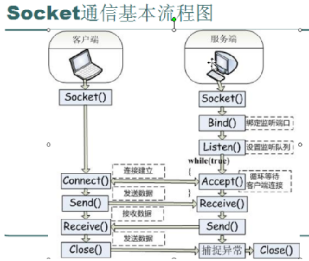

# 恶意windows程序

## Windows API 

### Windows API

- 一个广泛的功能集合
  管理（恶意）代码与微软程序库之间的交互方式
  功能强大

<!-- more -->

### 类型与匈牙利表示法

- 多数Windows API使用自己的名字来表示C语言类型，标准C如int通常不使用
- Windows总体使用匈牙利表示法作为API函数标识符
- 表达式使用一个前缀命名模式，来识别一个变量的类型
- 一个32位无符号整数的变量，或DWORD，会以dw开头

### 句柄

- 在操作系统中被打开或被创建的项
- 窗口、进程、模块、菜单、文件、管道、端口、互斥量等
- 有点像引用对象或其他某个内存位置的指针，但不能进行数学操作，也不总是表示对象地址；后续可以使用它来引用同一对象

### 文件系统函数

- CreateFile和OpenFile（文件、管道、流，以及I/O设备）
- ReadFile和WriteFile（对文件的读和写，都将文件作为流来操作）
- CreateFileMapping和MapViewofFile（文件映射）

前者从磁盘加载文件到内存，后者返回一个指向映射的基地址的指针。可用来访问内存中的文件。

### 特殊文件

- 访问方式与普通文件不一样：不能通过盘符与文件夹进行访问；
- 有些比普通文件更隐蔽：在列目录时不会显示出来；
- 可以提供对系统硬件和内部数据更强的访问能力；
- 可以作为字符串参数被传递给任何文件操作函数，并像普通文件一样进行操作。

## Windows注册表

- 根键：一共有 5 个顶层根键节点，每一个根键有一个特定的目的。
- 子键：一个子键就像一个文件夹中的子文件夹。
- 键值项：可以理解为文件。名称、类型、数据。

### 注册表根键

| **注册表根键**               | **描述**                                                     |
| ---------------------------- | ------------------------------------------------------------ |
| **HKEY_LOCAL_MACHINE(HKLM)** | **保存对本地机器全局设置；**                                 |
| **HKEY_CURRENT_USER(HKCU)**  | **保存当前用户特定的设置；**                                 |
| **HKEY_CLASSES_ROOT**        | **保存定义的类型信息；**                                     |
| **HKEY_CURRENT_CONTIG**      | **保存关于当前硬件配置的设置，特别是与当前和标准配置直接不同的部分；** |
| **HKEY_USERS**               | **定义默认用户、新用户和当前用户的配置；**                   |

### 常用注册表函数

RegOpenKeyEx 打开一个注册表键进行编辑和查询
RegSetValueEx 添加一个新值，并设置数值
RegGetValue 返回注册表中一个键值

**参考链接**
https://www.cnblogs.com/john-h/p/5886870.html
https://www.cnblogs.com/kzloser/archive/2012/11/07/2758404.html

**使用.reg文件的注册表脚本**
用.reg作为扩展的文件包含一个可读的注册表数据
双击运行后，会自动地通过合并文件包含的信息到注册表中

## 网络API

### WinINet API

- 保存在Wininet.dll中;
- 比Windows API更高一级，实现了应用层协议，如HTTP和FTP;
- 可以用来连接远程服务器，并获取指令。
- InternetOpen被用来初始化一个到互联网的连接。
- InternetOpenUrl被用来访问一个URL(它可以是一个HTTP页面或一个FTP资源）。
- InternetReadFile和ReadFile函数工作原理相似，允许程序从一个来自互联网的下载文件中读取数据。

## 跟踪恶意代码的运行

### DLL

- 保存恶意代码（保存为DLL比EXE更有利，可以附加到其他进程）；
- 使用Windows DLL；
- 使用第三方DLL（借其他程度的DLL文件来完成恶意代码自己的功能）

### 进程

- 恶意代码可以通过创建一个新进程，或修改一个已经存在的进程，来执行当前程序之外的代码。目前的恶意代码普遍**将自身代码作为其他进程的一部分**执行。
- 创建一个新的进程使用CreateProcess函数，让进程（恶意代码）共享系统内存。

### 服务

执行附加代码的另一种方式是将它作为服务安装

- Windows允许通过使用服务，来使任务作为后台应用程序运行，而不需要它们自己的进程或线程；

- 代码被Windows服务管理调度和运行，不需要用户输入；

- 服务通常作为**SYSTEM或其他特权账户**运行；

  （需要一个管理员权限才能安装一个服务）

- 能够当操作系统启动时自动运行，在系统上持久化驻留；

- 在任务管理器中**不作为一个进程显示**出来。

通过Windows API 来安装和操作服务

- OpenSCManager 返回一个服务控制管理器**句柄**，用来进行后续与服务相关的函数调用。
- CreateService 添加一个新服务到服务控制管理器，并且允许调用者制定服务是否在引导时自动启动，或者必须手动启动。
- StartService 启动一个服务，并且仅在服务被设置成手动启动时使用。

服务类型：

- WIN32_SHARE_PROCESS类型
  以**DLL**形式，并且在一个共享的进程中组合多个不同的服务。
- WIN32_OWN_PROCESS类型
  以EXE形式，作为一个独立进程运行。
- KERNEL_DRIVER
  以SYS形式，被用来加载代码到内核中执行。

### 组件对象模型COM

COM是什么：

- 一个接口标准
  使不同软件组件在不知道其他组件代码的接口规范时，相互之间可以进行调用。
- 分析使用COM的恶意代码
  要能够判断哪段代码会被作为一个COM函数进行调用运行。
- 支持任何编程语言
  被设计成一种可复用的软件组件，并可以被所有程序利用。

COM被实现成C/S框架：
客户端是使用COM对象的程序；
服务器是可复用的组件，就是COM对象本身。

## 内核模式、用户模式和原生API

### 内核与用户模式

通常，用户模式不能直接访问硬件，并且它被限制只能访问CPU上所有寄存器和可用指令的一个子集。为了在用户模式中操作硬件或改变内核中的状态，你必须依赖于Windows API。

### 原生API

原生API是用来和Windows进行交互的底层API，它们很少被非恶意程序使用，但是在恶意代码作者之间却很受欢迎。调用原生API函数可以绕过普通的Windows API。

当调用Windows API中的一个函数时,这个函数通常**不会直接执行请求的动作**，因为大多数重要数据结构都被保存在内核中，在内核外面的代码（用户模式代码) 是无法访问它们的。微软为了使用户应用程序能够达到必需的功能，创建了一个多步骤的调用过程。上图说明了对于大多数API调用来说，这是如何工作的。

用户应用程序被给予对**用户API**(比如kernel32.dll和其他DLL)的访问，这些DLL会调用**ntdll.dll**，这是一个特殊的DLL程序，它管理用户空间与内核的交互。然后处理器切换到内核模式,

ntdll函数像内核中的函数一样，使用API和结构体。这些函数组成了**原生API**。

**绕过检测**：直接使用ntdll中的函数。
